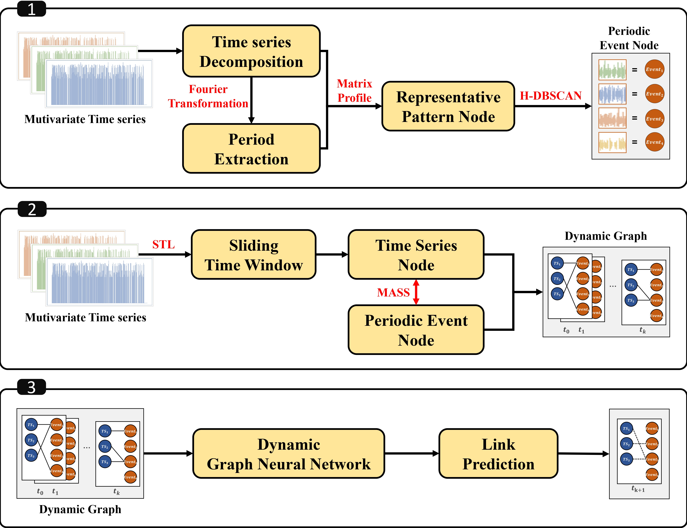

# Dynamic Periodic Event Bipartite Graph
[](https://doi.org/10.5281/zenodo.14280464)
paper : Dynamic Periodic Event Bipartite Graphs for Multivariate Time Series Pattern Prediction  
repo : https://github.com/peg-repo/periodic-event-graph



## Requirements & Setup
This codebase utilizes Anaconda for managing environmental dependencies. Please follow these steps to set up the environment:

1. **Download Anaconda:** [Click here](https://www.anaconda.com/download) to download Anaconda.

2. **Clone the Repository:**
Git Large File Storage (`git-lfs`) is required to download big size datasets in our repository. Clone the repository using the following command.
   ```bash
   git clone https://github.com/peg-repo/periodic-event-graph
   ```

3. **Install Requirements:**
   - Navigate to the cloned repository:
     ```bash
     cd periodic-event-graph
     ```
   - Create a Conda environment from the provided `environment.yaml` file:
     ```bash
     conda env create -f environment.yaml
     ```
   - Activate the Conda environment:
     ```bash
     conda activate periodic-graph
     ```

This will set up the environment required to run the codebase.

## Datasets
Below are the details and download links for datasets used in our experiments:

### Power Consumption 
This dataset consists of power consumption data for a local community comprising 50 households and 1 public building. The public building data used in the experiment provides consumption profiles for the building, categorized by appliances. It covers 96 intervals per day at 15-minute intervals, offering a year's worth of data and profiles for 10 appliances. [(Download)](https://zenodo.org/records/6778401)

### Traffic 
This dataset contains 48 months (2015-2016) of hourly data from the California Department of Transportation. It describes road occupancy rates (ranging between 0 and 1) measured by various sensors on San Francisco Bay area freeways. [(Download)](https://pems.dot.ca.gov)

### Exchange Rate   
This dataset includes daily exchange rates of eight foreign countries: Australia, Britain, Canada, Switzerland, China, Japan, New Zealand, and Singapore, spanning from 1990 to 2016. [(Download)](https://github.com/MTS-BenchMark/MvTS?tab=readme-ov-file)

These datasets provide valuable resources for our experiments.

## Periodic Event Graph Generation
The `--period` parameter is used for STL algorithm.

```python
# Power consumption
python graph_generation.py --dataset_name 'power' --period 4 --motif 5 --cluster 2

# Exchange rate
python graph_generation.py --dataset_name 'exchange' --period 4 --motif 3 --cluster 2

# Traffic
python graph_generation.py --dataset_name 'traffic' --period 4 --motif 3 --cluster 3
```

These commands generate periodic event graphs for different datasets with specified parameters.

## Preprocessing

Replace `<dataset_name>` with one of the following options: `traffic`, `power`, `exchange`.

#### Periodic Event Graph <em>without Residual Node</em>
```python
python preprocess_data.py --dataset_name <dataset_name>_peg_wo_residual
```

#### Periodic Event Graph <em>with Residual Node</em>
```python
python preprocess_data.py --dataset_name <dataset_name>_peg_w_residual
```

#### Periodic Event Graph <em>with Simple Residual Node</em>
```python
python preprocess_data.py --dataset_name <dataset_name>_peg_w_simple_residual
```

These commands preprocess the data for the specified dataset, generating periodic event graphs with or without residual nodes as required.

## Dynamic GNNs Link Prediction

Replace `<dataset_name>` with one of the following options: `traffic`, `power`, `exchange`.
Replace `<dgnn_model>` with one of the following options: `JODIE`, `DyRep`, `TGAT`, `TGN`, `GraphMixer`.

```python
python train_link_prediction.py --dataset_name <dataset_name>_peg_wo_residual --model_name <dgnn_model> --load_best_configs --num_runs 5 --num_epochs 10
```

This command trains a dynamic graph neural network for link prediction on the specified dataset using the selected model, with best configurations loaded, running 5 trials for 10 epochs each.


#### Optional arguments
```
  --dataset_name                    dataset to be used
  --batch_size                      batch size
  --model_name                      name of the model, note that EdgeBank is only applicable for evaluation
  --gpu GPU                         number of gpu to use
  --num_neighbors                   number of neighbors to sample for each node
  --sample_neighbor_strategy        how to sample historical neighbors
  --time_scaling_factor             the hyperparameter that controls the sampling preference with time interval, a large time_scaling_factor tends to sample more on recent links, 0.0 corresponds to uniform sampling, it works when sample_neighbor_strategy == time_interval_aware
  --num_walk_heads                  number of heads used for the attention in walk encoder
  --num_heads                       number of heads used in attention layer
  --num_layers                      number of model layers
  --walk_length                     length of each random walk
  --time_gap                        time gap for neighbors to compute node features
  --time_feat_dim                   dimension of the time embedding
  --position_feat_dim               dimension of the position embedding
  --edge_bank_memory_mode           how memory of EdgeBank works
  --time_window_mode                how to select the time window size for time window memory
  --patch_size                      patch size
  --channel_embedding_dim           dimension of each channel embedding
  --max_input_sequence_length       maximal length of the input sequence of each node
  --learning_rate                   learning rate
  --dropout                         dropout rate
  --num_epochs                      number of epochs
  --optimizer                       name of optimizer
  --weight_decay                    weight decay
  --patience                        patience for early stopping
  --val_ratio                       ratio of validation set
  --test_ratio                      ratio of test set
  --num_runs                        number of runs
  --test_interval_epochs            how many epochs to perform testing once
  --negative_sample_strategy        strategy for the negative edge sampling
  --load_best_configs               whether to load the best configurations
```

## Special Thanks to
We extend our gratitude to the authors of the following libraries for generously sharing their source code and dataset:
[DyGLib](https://github.com/yule-BUAA/DyGLib/tree/master),
[MASS](https://github.com/tylerwmarrs/mass-ts),
[Peak over Threshold](https://github.com/cbhua/peak-over-threshold),
[MvTS](https://github.com/MTS-BenchMark/MvTS?tab=readme-ov-file)

Your contributions are greatly appreciated.

## Citation
```
@article{park2025dynamic,
  title={Dynamic Periodic Event Graphs for multivariate time series pattern prediction},
  author={Park, SoYoung and Lee, HyeWon and Lim, Sungsu},
  journal={PeerJ Computer Science},
  volume={11},
  pages={e2717},
  year={2025},
  publisher={PeerJ Inc.}
}
```
